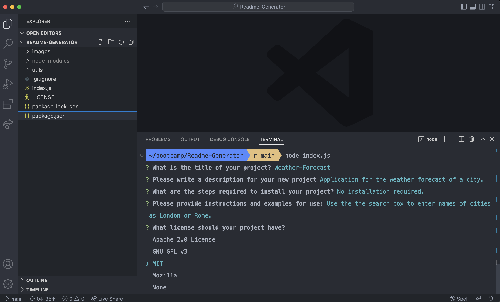
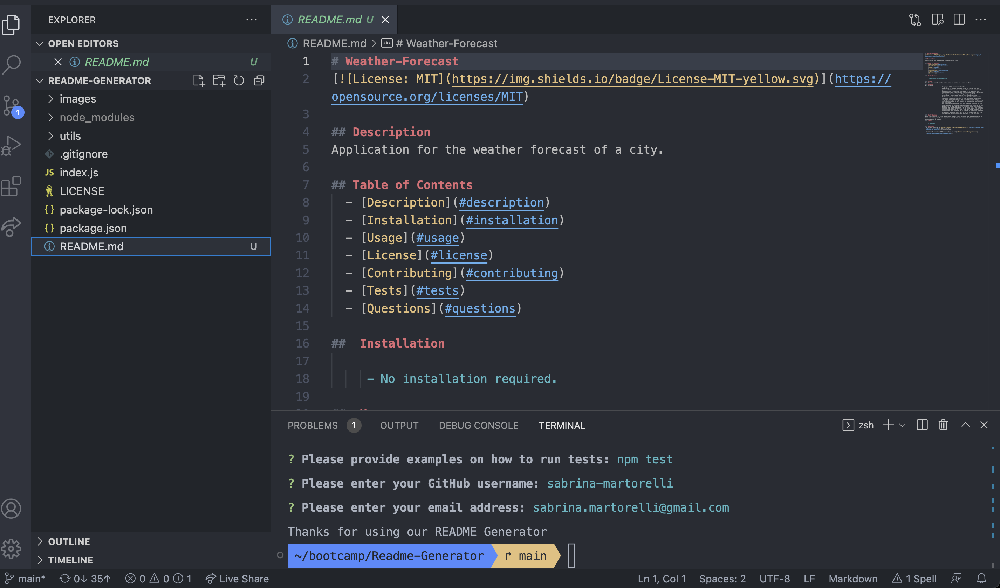
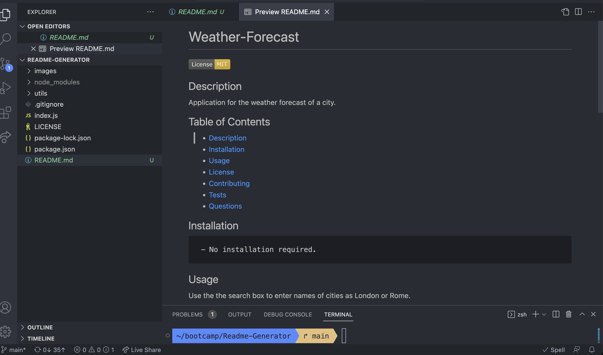

# README Generator


## Description

Command-line application that dynamically generates a professional README.md file from a user's input using the [Inquirer package](https://www.npmjs.com/package/inquirer).


## Sreenshoot






## Installation

N/A 


## Usage


The application will be invoked by using the following command:

```bash
node index.js
```

When a user is prompted for information about the application repository then a high-quality, professional README.md is generated with:
    * The title of the project 
    * Sections entitled:
      * Description 
      * Table of Contents 
      * Installation 
      * Usage 
      * License 
      * Contributing 
      * Tests 
      * Questions
When a user enters the project title then it is displayed as the title of the README

When a user enters a description, installation instructions, usage information, contribution guidelines, and test instructions then this information is added to the sections of the README entitled Description, Installation, Usage, Contributing, and Tests

When a user chooses a license for their application from a list of options then a badge for that license is added near the top of the README and a notice is added to the section of the README entitled **License** that explains which license the application is covered under

When a user enters their GitHub username then this is added to the section of the README entitled Questions, with a link to their GitHub profile

When a user enters their email address then this is added to the section of the README entitled Questions, with instructions on how to reach them with additional questions

When a user clicks on the links in the **Table of Contents** then they are taken to the corresponding section of the README


## Credits


1. https://www.npmjs.com/package/inquirer- A collection of common interactive command line user interfaces.
2. https://momentjs.com/ -Parse, validate, manipulate,and display dates and times in JavaScript.


## License

The MIT License (MIT)

Copyright (c) 2023 Sabrina Martorelli

Permission is hereby granted, free of charge, to any person obtaining a copy of this software and associated documentation files (the "Software"), to deal in the Software without restriction, including without limitation the rights to use, copy, modify, merge, publish, distribute, sublicense, and/or sell copies of the Software, and to permit persons to whom the Software is furnished to do so, subject to the following conditions:

The above copyright notice and this permission notice shall be included in all copies or substantial portions of the Software.

THE SOFTWARE IS PROVIDED "AS IS", WITHOUT WARRANTY OF ANY KIND, EXPRESS OR IMPLIED, INCLUDING BUT NOT LIMITED TO THE WARRANTIES OF MERCHANTABILITY, FITNESS FOR A PARTICULAR PURPOSE AND NONINFRINGEMENT. IN NO EVENT SHALL THE AUTHORS OR COPYRIGHT HOLDERS BE LIABLE FOR ANY CLAIM, DAMAGES OR OTHER LIABILITY, WHETHER IN AN ACTION OF CONTRACT, TORT OR OTHERWISE, ARISING FROM, OUT OF OR IN CONNECTION WITH THE SOFTWARE OR THE USE OR OTHER DEALINGS IN THE SOFTWARE.


## Walkthrough video link

[Recording link](https://drive.google.com/file/d18PPzE9m8FGdDYVpZeOXw6HU-9IJa4BNp/view)


## README.md file example

[Example file](./files/READMEExample.md)


